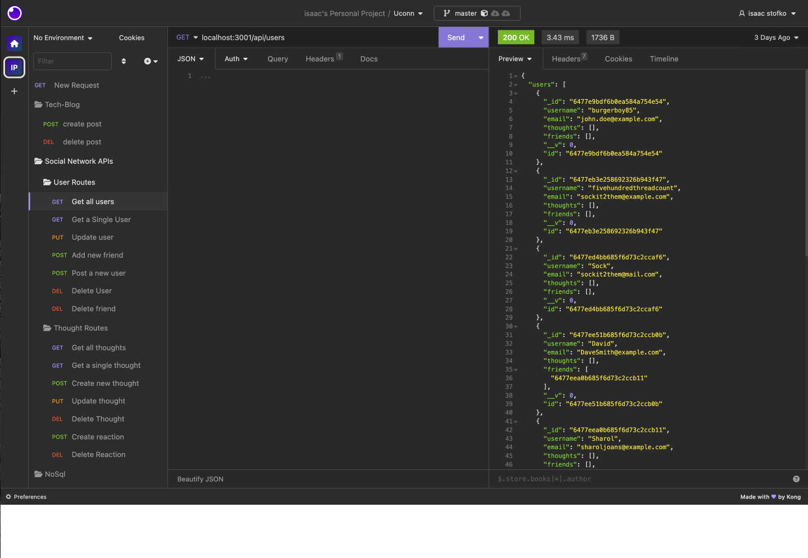
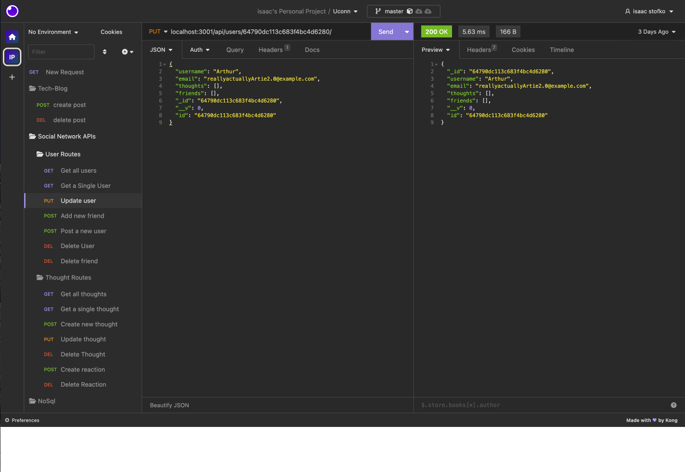
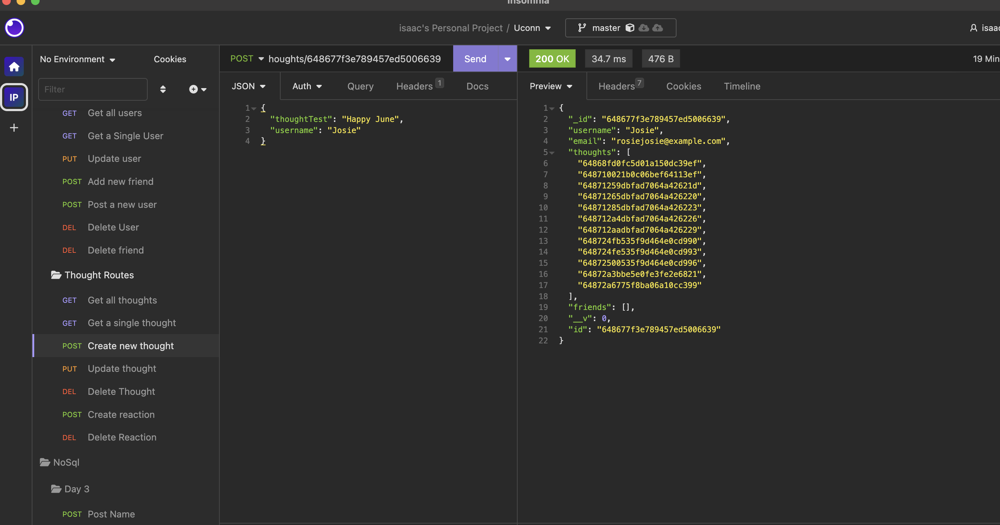
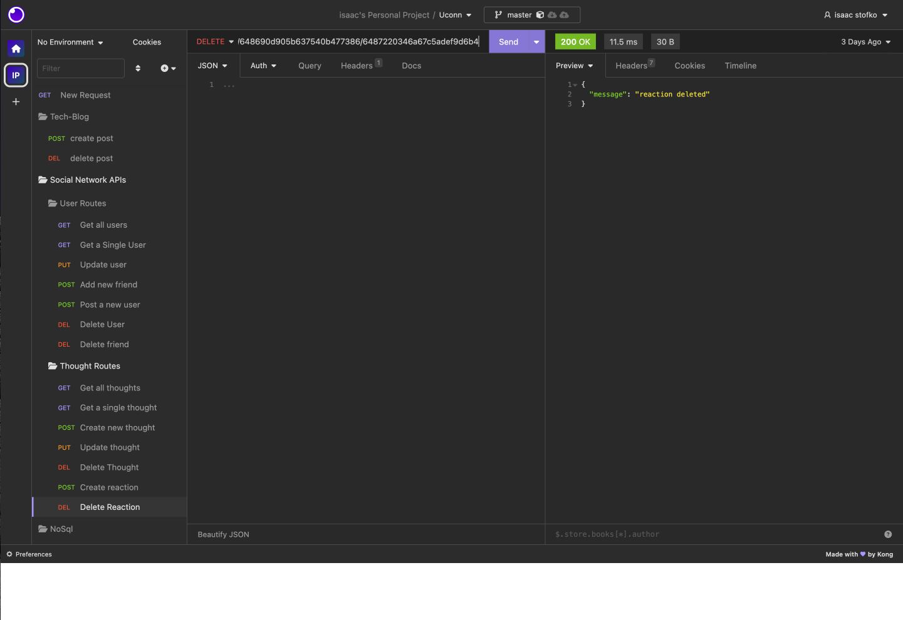

# Social Media Network API

This application provides a backend API for a social media site. It allows users to perform various actions such as adding and deleting friends, posting and deleting thoughts, and reacting to their friends' thoughts. The API is designed to support the following routes:

   

# Routes

## User Routes

GET /api/users: Retrieves a list of all users.  
GET /api/users/:userId: Retrieves information about a specific user.  
POST /api/users: Creates a new user.  
PUT /api/users/:userId: Updates information about a specific user.  
DELETE /api/users/:userId: Deletes a specific user.  

## Friend Routes  

GET /api/users/:userId/friends: Retrieves the list of friends for a specific user.  
POST /api/users/:userId/friends: Adds a new friend to a specific user.  
DELETE /api/users/:userId/friends/:friendId: Removes a friend from a specific user.  
Thought Routes  
GET /api/users/:userId/thoughts: Retrieves the list of thoughts for a specific user.  
GET /api/users/:userId/thoughts/:thoughtId: Retrieves information about a specific thought of a user.  
POST /api/users/:userId/thoughts: Creates a new thought for a specific user.  
PUT /api/users/:userId/thoughts/:thoughtId: Updates information about a specific thought of a user.  
DELETE /api/users/:userId/thoughts/:thoughtId: Deletes a specific thought of a user.  

## Reaction Routes

POST /api/thoughts/:thoughtId/reactions: Adds a reaction to a specific thought.  
DELETE /api/thoughts/:thoughtId/reactions/:reactionId: Removes a reaction from a specific thought.  

## Getting Started

To set up and run the application locally, follow these steps:

Clone the repository: git clone <repository-url>  
Install the dependencies: npm install  
Set up the environment variables by creating a .env file (you can use .env.example as a template)  
Start the application: npm start  
Make sure to replace <repository-url> with the actual URL of the repository.  

Technologies Used
Node.js  
Express.js  
MongoDB  

License
This project is licensed under the MIT License.

